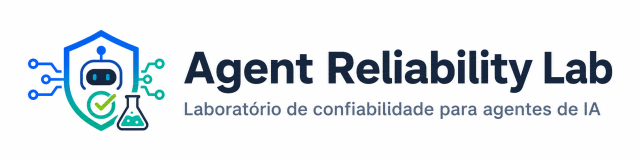
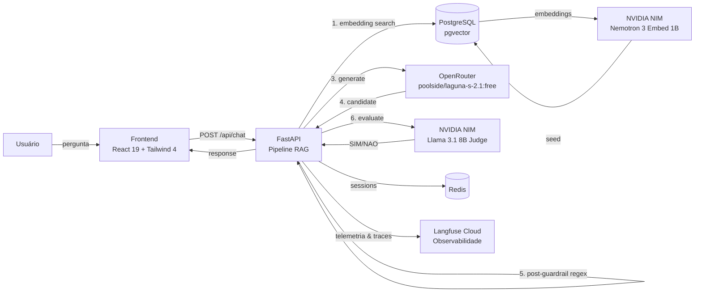

<p align="center">
  
</p>

<p align="center">
  <a href="https://github.com/rodrigoss384/agent-reliability-lab/releases/tag/v1.1.0"></a>
  
  
  
  
  
  
  
  
  
  
  
</p>

---

Laboratório de confiabilidade para agentes de IA. Demonstração reproduzível de um pipeline RAG com guardrails que previnem vazamento de dados sensíveis (PII) — antes e depois da chamada ao LLM, avaliação por juiz LLM e observabilidade ponta a ponta com **Langfuse Cloud**.

## Arquitetura



1. **Retrieval** — busca semântica no PostgreSQL/pgvector via NVIDIA NIM embeddings (`nvidia/nemotron-3-embed-1b`, 2048 dim)
2. **Pré-guardrail** — regex bloqueia chunks com `R$`, CPF, CNPJ, e-mail antes do LLM (chunks com flag `preco_publico` ignoram `R$`)
3. **Geração** — chain OpenRouter primário → NVIDIA NIM fallback automático quando primário atinge rate limit
4. **Pós-guardrail** — regex na resposta candidata + judge LLM no NVIDIA NIM avalia se contém PII
5. **Observabilidade (Langfuse)** — rastreamento em tempo real de cada nó (`retrieval`, `intent_classifier`, `llm_generation`, `is_sensitive`, `classify_pii`, `pii_judge`) com metadados de decisão dos guardrails (`guardrail_state`, `pii_categories`, `preco_publico_bypass`)
6. **Sessões** — Redis com TTL configurável (fallback memória), lock por `session_id`

## O que está implementado

- Pipeline RAG completo: retrieval → pré-guardrail (regex) → geração (chain OpenRouter primário, NVIDIA NIM fallback) → pós-guardrail (regex + judge LLM no NVIDIA NIM)
- **Observabilidade com Langfuse Cloud**: instrumentação em Spans OpenTelemetry rastreando cada etapa da execução, extraindo metadados de bypass de catálogo (`preco_publico_bypass`), categorias detectadas (`pii_categories`) e estado final (`guardrail_state`)
- Detecção de PII sintética: CPF, CNPJ, e-mail, valores monetários (`R$`)
- Bloqueio duro no input do usuário: regex no `request.question` antes do IntentClassifier/retrieval/LLM (estado `bloqueado-na-entrada`)
- Pré-guardrail com flag `preco_publico`: chunks de catálogo público (preços de planos) passam sem bloquear `R$`
- Pós-guardrail com bypass de catálogo: se a resposta ecoa `R$` mas veio de chunk `preco_publico`, judge é pulado e resposta é entregue
- Sentinela `judge_block` em `pii_categories` quando judge detecta PII sem categoria específica de regex
- Timings separados: `pre_guardrail_ms`, `llm_ms`, `pii_regex_ms`, `pii_judge_ms` (soma em `post_guardrail_ms`)
- Chain de chat = exatamente 2 provedores: OpenRouter primário + NVIDIA NIM fallback automático (visível em `trace.fallback_used`)
- Embedding primário = NVIDIA NIM (`nvidia/nemotron-3-embed-1b`, 2048 dim); judge também no NVIDIA NIM
- Busca semântica no PostgreSQL/pgvector (2048 dim) — falha de embedding propaga `DependencyUnavailable` (sem fallback)
- Estado `limite-cota`: quando todos os provedores esgotam quota gratuita, UI mostra instrução clara
- Sessões com lock por `session_id` (409 em concorrência), histórico sanitizado, TTL configurável
- Persistência Redis com fallback automático para memória
- Health check real de PostgreSQL, Redis e embedding provider
- Bootstrap automático ao subir: `alembic upgrade head` + seed com retry e idempotência
- Table Editor READ-ONLY (`GET /api/admin/knowledge-documents`): inspeção de `knowledge_documents` com schema de colunas, resumo estatístico do embedding (norma, min/max/mean, first5/last5) e flag `preco_publico`
- Interface React 19 + Tailwind CSS 4 com tema Dracula, trace de evidência sanitizada, métricas de chunks, botões "Nova conversa" e "Ver Tabelas de Dados"
- 63 testes de integração (pytest), 24 testes unitários (vitest), E2E (Playwright, opcional)
- Toda configuração via `.env`

---

## Stack

| Camada | Tecnologia |
|--------|-----------|
| Backend | Python 3.12, FastAPI, SQLAlchemy, Alembic, Pydantic |
| Banco | PostgreSQL 17 + pgvector (busca semântica), Redis 7 (sessões) |
| LLM / Embeddings | OpenRouter API (primário do chat); NVIDIA NIM (fallback chat, embedding primário, judge) — endpoint OpenAI-compatible em `integrate.api.nvidia.com/v1` |
| Observabilidade | Langfuse Cloud (Python SDK v4 / OpenTelemetry) — tracing, spans e tags de guardrails |
| Frontend | React 19, TypeScript 5, Vite 8, Tailwind CSS 4 |
| Testes | pytest, vitest, Playwright, ruff |
| Infra | Docker Compose (4 serviços: postgres, redis, api, frontend) |

---

## Histórico de Implementação

| # | Versão | Escopo & Funcionalidades Implementadas | Tecnologias & Componentes | Commit |
|---|--------|-----------------------------------------|---------------------------|--------|
| 1 | `v1.0.0` | **Pipeline RAG com Guardrails PII, Chain LLM com Fallback, Flag Preço Público e Table Editor** — Detecção de PII no input (bloqueio duro), pré-guardrail em chunks com bypass para catálogo público (`preco_publico`), pós-guardrail regex + juiz LLM (NVIDIA NIM Llama 3.1 8B), chain de geração OpenRouter → NVIDIA NIM, busca semântica no pgvector (2048 dim), persistência Redis com lock por `session_id` e interface React 19 Dracula com Table Editor READ-ONLY. | FastAPI, pgvector, OpenRouter, NVIDIA NIM, Redis, React 19, Tailwind CSS 4, Vitest, Pytest | [35da5bb](https://github.com/rodrigoss384/agent-reliability-lab/commit/35da5bb) |
| 2 | `v1.1.0` | **Observabilidade com Langfuse Cloud & Rastreamento Granular de Guardrails** — Instrumentação completa em Spans OpenTelemetry (`pre-guardrail`, `retrieval`, `llm_generation`, `pii_judge`, `is_sensitive`, `classify_pii`) com metadados de execução (`guardrail_state`, `pii_categories`, `preco_publico_bypass`) para análise e comprovação de decisões dos guardrails e falsos positivos. | Langfuse Python SDK, OpenTelemetry, FastAPI Lifespan Tracing | [309f3a6](https://github.com/rodrigoss384/agent-reliability-lab/commit/309f3a6) |

---

## Observabilidade com Langfuse Cloud

O projeto é integrado nativamente ao **Langfuse Cloud** para fornecer rastreabilidade completa das decisões de segurança e desempenho do pipeline RAG.

### O que é registrado em cada Trace:
- **Hierarquia de Spans:** Cada nó do pipeline é emitido como uma observação individual (`retrieval` do tipo `RETRIEVER`, `intent_classifier` e `llm_generation` do tipo `GENERATION`, e funções de validação como `SPAN`).
- **Metadados do Guardrail (Root Trace):**
  - `guardrail_state`: estado final da transação (`entregue`, `bloqueado-na-entrada`, `bloqueado-na-saida`, `falha-segura` ou `limite-cota`).
  - `pii_categories`: lista de categorias sensíveis identificadas (ex.: `["CPF"]`, `["R$"]`, `["judge_block"]`).
  - `preco_publico_bypass`: flag booleana indicando se o bypass de catálogo público foi acionado para permitir a menção de valores monetários.

### Configurando Langfuse no `.env`
```env
LANGFUSE_PUBLIC_KEY="pk-lf-..."
LANGFUSE_SECRET_KEY="sk-lf-..."
LANGFUSE_BASE_URL="https://us.cloud.langfuse.com" # ou https://cloud.langfuse.com (EU)
```

---

## Como usar

### Pré-requisitos

- Docker + Docker Compose
- Chave da [OpenRouter](https://openrouter.ai/keys) (gratuita)
- Credenciais do [Langfuse Cloud](https://cloud.langfuse.com) (opcional, para observabilidade)

### 1. Configurar

```bash
cp .env.example .env
# Edite .env e cole suas chaves (OPENROUTER_API_KEY, NVIDIA_NIM_API_KEY, LANGFUSE_*)
```

### 2. Subir

```bash
docker compose up -d
```

O container `api` roda automaticamente migration + seed com embeddings (12 documentos fictícios de um SaaS). A inicialização leva ~15s.

### 3. Acessar

- **Frontend:** http://localhost:5173
- **API docs:** http://localhost:8000/docs
- **Langfuse Cloud Dashboard:** https://us.cloud.langfuse.com

---

## Configurando Fallback NVIDIA NIM (recomendado)

O chain de chat usa **OpenRouter como primário** e **NVIDIA NIM como fallback automático** quando o primário atinge rate limit. Embedding e judge também rodam no NVIDIA NIM (sem fallback).

### Criar conta NVIDIA

1. Acesse [https://build.nvidia.com](https://build.nvidia.com)
2. Login com Google ou GitHub (sem cartão de crédito)
3. Vá em [https://build.nvidia.com/settings/keys](https://build.nvidia.com/settings/keys) e gere uma API key (formato `nvapi-...`)
4. Créditos trial inclusos para Developer Program

### Adicionar ao `.env`

```env
NVIDIA_NIM_API_KEY=nvapi-...
```

### Limites gratuitos

| Provedor | Limite |
|----------|--------|
| OpenRouter (free models) | 50 req/dia (sem credits); 1.000 req/dia com ≥10 credits |
| NVIDIA NIM (Developer Program) | Créditos trial para prototipagem; modelo `llama-3.1-8b-instruct` e `nemotron-3-embed-1b` cobertos |

### Como o fallback aparece no trace

Quando o primário OpenRouter atinge rate limit, o chain automaticamente chama o fallback NVIDIA NIM. O trace retornado em `/api/chat` mostra:

```json
{
  "model_used": "meta/llama-3.1-8b-instruct",
  "trace": {
    "primary_model": "poolside/laguna-s-2.1:free",
    "fallback_used": true,
    "judge_model": "meta/llama-3.1-8b-instruct",
    "embedding_provider": "nvidia_nim"
  }
}
```

Sem `NVIDIA_NIM_API_KEY`, o app continua funcionando — rate limit do OpenRouter retorna `limite-cota` com mensagem instrutiva na UI apontando para configuração da chave NIM.

---

## Desenvolvimento local (sem Docker)

```bash
cp .env.example .env

# Suba só infra
docker compose up -d postgres redis

# Migration + seed
uv run python scripts/bootstrap.py

# Backend (Terminal 1)
uv run uvicorn app.main:app --reload

# Frontend (Terminal 2)
npm --prefix frontend run dev
```

### Rodar testes

```bash
uv run pytest tests/ -v                    # 63 testes de integração
npm --prefix frontend run test             # 24 testes unitários (vitest)
npm --prefix frontend run test:browser     # E2E (requer backend)
uv run ruff check app/ tests/              # Lint
```

---

## API

| Método | Rota | Descrição |
|--------|------|-----------|
| `POST` | `/api/chat` | Processa pergunta no pipeline RAG com guardrails PII |
| `GET` | `/api/conversation/{session_id}` | Recupera histórico sanitizado (apenas turnos `entregue`) |
| `GET` | `/api/health` | Consulta saúde das dependências (PostgreSQL, Redis, embedding) |
| `GET` | `/api/models` | Lista modelos configurados (primário, fallback) |
| `GET` | `/api/admin/knowledge-documents` | Lista documentos de conhecimento (Table Editor, READ-ONLY, dev-only) |

### POST /api/chat

```json
// Request
{ "question": "Como funciona o cancelamento?", "session_id": "opcional" }

// Response 200
{
  "session_id": "uuid",
  "answer": "O cancelamento pode ser feito a qualquer momento...",
  "model_used": "google/gemini-2.0-flash-001",
  "guardrail_state": "entregue",
  "trace": {
    "retrieved_count": 2,
    "used_count": 1,
    "blocked_count": 1,
    "guardrail_state": "entregue",
    "total_ms": 1234,
    "sources": ["faq.md"],
    "input_pii_detected": false,
    "pii_categories": [],
    "pii_categories_retrieval": ["R$"],
    "judge_decision": "NAO"
  }
}
```

Estados `guardrail_state`: `entregue`, `bloqueado-na-entrada`, `bloqueado-na-saida`, `falha-segura`, `limite-cota`.

### GET /api/admin/knowledge-documents

```bash
# Listar todos (paginado)
curl 'http://localhost:8000/api/admin/knowledge-documents?limit=20'

# Filtrar por source
curl 'http://localhost:8000/api/admin/knowledge-documents?source=planos.md'
```

---

## Estrutura do projeto

```text
.
├── app/
│   ├── main.py              # FastAPI — endpoints, pipeline RAG e tracing Langfuse
│   ├── providers.py          # LLMProvider (OpenRouter), NvidiaNimProvider (fallback chat), NvidiaNimEmbeddingProvider, NvidiaNimJudge, Retriever
│   ├── models.py             # SQLAlchemy — KnowledgeDocument (pgvector)
│   ├── db.py                 # Engine e sessão do banco
│   ├── config.py             # Configuração centralizada (.env)
│   └── seed.py               # Popula banco com embeddings via NVIDIA NIM
├── frontend/
│   └── src/
│       ├── api/client.ts     # Cliente HTTP para /api/chat e /api/conversation
│       └── features/rag-pii-chat/
│           ├── ChatScreen.tsx       # Componente principal
│           ├── TableEditor.tsx      # Overlay READ-ONLY para inspeção de dados
│           ├── ChatScreen.test.tsx  # 24 testes vitest
│           └── ChatScreen.spec.ts   # 9 testes Playwright
├── tests/
│   └── integration/
│       └── test_chat_guardrail_slice.py  # 63 testes pytest
├── openapi/
│   └── rag-pii-guardrails.yaml    # Contrato OpenAPI 3.1 design-first
├── migrations/                    # Alembic — 1 migration consolidada
├── scripts/
│   └── bootstrap.py               # Migration + seed + metadata flags com retry
├── compose.yaml                   # 4 serviços Docker
├── Dockerfile                     # Build do backend
├── frontend/Dockerfile            # Build do frontend
├── .env.example                   # Template de variáveis de ambiente
└── docs/
    └── logo.svg
```
