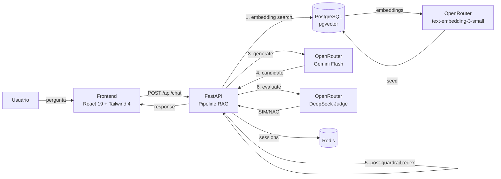

<p align="center">
  
</p>

<p align="center">
  
  
  
  
  
  
  
  
  
  
</p>

---

Laboratório de confiabilidade para agentes de IA. Demonstração reproduzível de um pipeline RAG com guardrails que previnem vazamento de dados sensíveis (PII) — antes e depois da chamada ao LLM, mais avaliação por juiz.

## Arquitetura



1. **Retrieval** — busca semântica no PostgreSQL/pgvector (fallback keyword se DB indisponível)
2. **Pré-guardrail** — regex bloqueia chunks com `R$`, CPF, CNPJ, e-mail antes do LLM
3. **Geração** — OpenRouter (Gemini Flash); fallback para Llama 3.2 se primário falhar
4. **Pós-guardrail** — regex na resposta candidata + Judge LLM (DeepSeek) avalia se contém PII
5. **Sessões** — Redis com TTL configurável (fallback memória), lock por `session_id`

## O que está implementado — `f91db3d`

- Pipeline RAG completo: retrieval → pré-guardrail (regex) → geração (OpenRouter) → pós-guardrail (regex + judge LLM)
- Detecção de PII sintética: CPF, CNPJ, e-mail, valores monetários (`R$`)
- 3 modelos OpenRouter configuráveis via `.env`: primário, fallback e juiz — todos free-tier
- Embeddings via OpenRouter (`text-embedding-3-small`) com população automática do pgvector
- Busca semântica no PostgreSQL/pgvector com fallback para keyword matching
- Fallback do LLM: primário falha → modelo secundário automático
- Sessões com lock por `session_id` (409 em concorrência), histórico sanitizado, TTL configurável
- Persistência Redis com fallback automático para memória
- Health check real de PostgreSQL e Redis
- Bootstrap automático ao subir: `alembic upgrade head` + seed com retry e idempotência
- Interface React 19 + Tailwind CSS 4 com tema Dracula, trace de evidência sanitizada, métricas de chunks
- 25 testes de integração (pytest), 10 unitários (vitest), 6 E2E (Playwright)
- Toda configuração via `.env`

---

## Stack

| Camada | Tecnologia |
|--------|-----------|
| Backend | Python 3.12, FastAPI, SQLAlchemy, Alembic, Pydantic |
| Banco | PostgreSQL 17 + pgvector (busca semântica), Redis 7 (sessões) |
| LLM / Embeddings | OpenRouter API (Gemini Flash, Llama 3.2, DeepSeek Chat, text-embedding-3-small) |
| Frontend | React 19, TypeScript 5, Vite 8, Tailwind CSS 4 |
| Testes | pytest, vitest, Playwright, ruff |
| Infra | Docker Compose (4 serviços: postgres, redis, api, frontend) |

---

## Como usar

### Pré-requisitos

- Docker + Docker Compose
- Chave da [OpenRouter](https://openrouter.ai/keys) (gratuita)

### 1. Configurar

```bash
cp .env.example .env
# Edite .env e cole sua OPENROUTER_API_KEY
```

### 2. Subir

```bash
docker compose up -d
```

O container `api` roda automaticamente migration + seed com embeddings (12 documentos fictícios de um SaaS). A inicialização leva ~15s.

### 3. Acessar

- **Frontend:** http://localhost:5173
- **API docs:** http://localhost:8000/docs

### 4. Testar os guardrails

| Pergunta | Esperado |
|----------|----------|
| "Quais são os planos disponíveis?" | Chunks com `R$` bloqueados pelo pré-guardrail → `BLOCKED` |
| "Como funciona o cancelamento?" | Chunks limpos → resposta do LLM → `ENTREGUE` |
| "Qual o CPF do João?" | Se o LLM gerar CPF falso, judge bloqueia → `BLOCKED_OUTPUT` |

---

## Desenvolvimento local (sem Docker)

```bash
cp .env.example .env

# Suba só infra
docker compose up -d postgres redis

# Migration + seed
uv run python scripts/bootstrap.py

# Backend (Terminal 1)
uv run uvicorn app.main:app --reload

# Frontend (Terminal 2)
npm --prefix frontend run dev
```

### Rodar testes

```bash
uv run pytest tests/ -v                    # 25 testes de integração
npm --prefix frontend run test             # 10 testes unitários (vitest)
npm --prefix frontend run test:browser     # 6 testes E2E (requer backend)
uv run ruff check app/ tests/              # Lint
```

---

## API

| Método | Rota | Descrição |
|--------|------|-----------|
| `POST` | `/api/chat` | Processa pergunta no pipeline RAG com guardrails |
| `GET` | `/api/conversation/{session_id}` | Histórico sanitizado (apenas turns `entregue`) |
| `GET` | `/api/health` | Saúde do PostgreSQL e Redis |
| `GET` | `/api/models` | Modelos configurados (primário, fallback) |

### POST /api/chat

```json
// Request
{ "question": "Como funciona o cancelamento?", "session_id": "opcional" }

// Response 200
{
  "session_id": "uuid",
  "answer": "O cancelamento pode ser feito a qualquer momento...",
  "model_used": "google/gemini-2.0-flash-001",
  "guardrail_state": "entregue",
  "trace": {
    "retrieved_count": 2,
    "used_count": 1,
    "blocked_count": 1,
    "guardrail_state": "entregue",
    "total_ms": 1234,
    "sources": ["faq.md"]
  }
}
```

Estados `guardrail_state`: `entregue`, `bloqueado-na-entrada`, `bloqueado-na-saida`, `falha-segura`.

---

## Estrutura do projeto

```text
.
├── app/
│   ├── main.py              # FastAPI — endpoints e pipeline RAG
│   ├── providers.py          # LLMProvider, FallbackProvider, Judge, Retriever
│   ├── models.py             # SQLAlchemy — KnowledgeDocument (pgvector)
│   ├── db.py                 # Engine e sessão do banco
│   ├── config.py             # Configuração centralizada (.env)
│   └── seed.py               # Popula banco com embeddings via OpenRouter
├── frontend/
│   └── src/
│       ├── api/client.ts     # Cliente HTTP para /api/chat e /api/conversation
│       └── features/rag-pii-chat/
│           ├── ChatScreen.tsx       # Componente principal
│           ├── ChatScreen.test.tsx  # 10 testes vitest
│           └── ChatScreen.spec.ts   # 6 testes Playwright
├── tests/
│   └── integration/
│       └── test_chat_guardrail_slice.py  # 25 testes pytest
├── openapi/
│   └── rag-pii-guardrails.yaml    # Contrato OpenAPI 3.1 design-first
├── migrations/                    # Alembic — knowledge_documents
├── scripts/
│   └── bootstrap.py               # Migration + seed com retry
├── compose.yaml                   # 4 serviços Docker
├── Dockerfile                     # Build do backend
├── frontend/Dockerfile            # Build do frontend
├── .env.example                   # Template de variáveis de ambiente
└── docs/
    └── logo.svg
```

